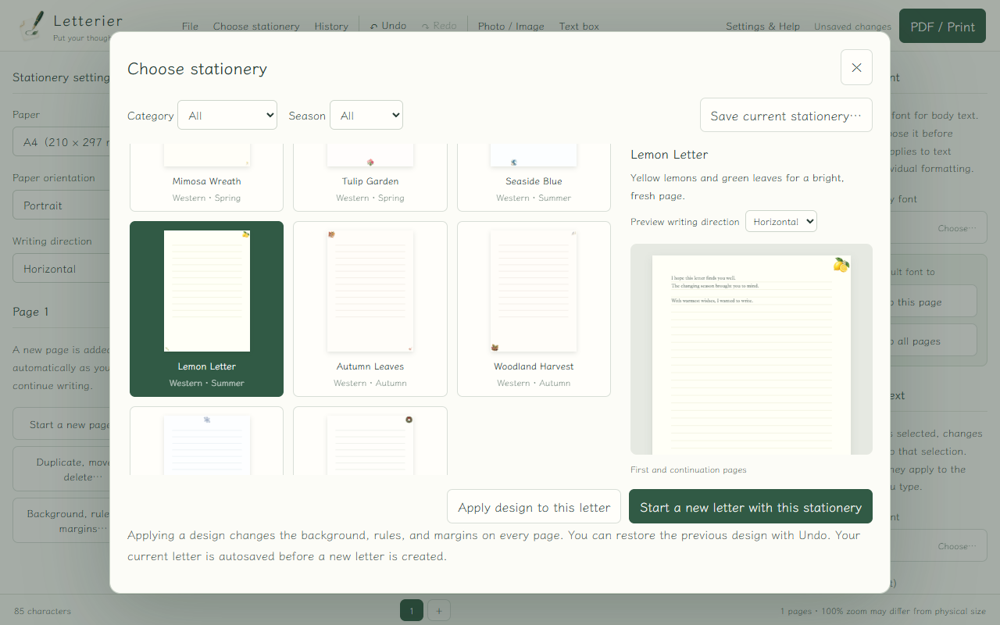
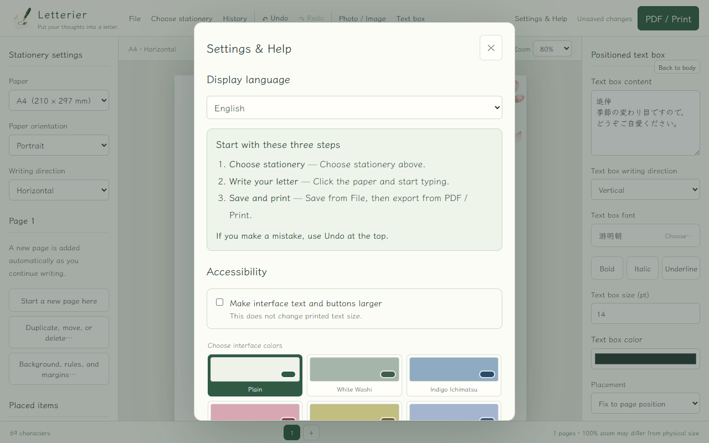
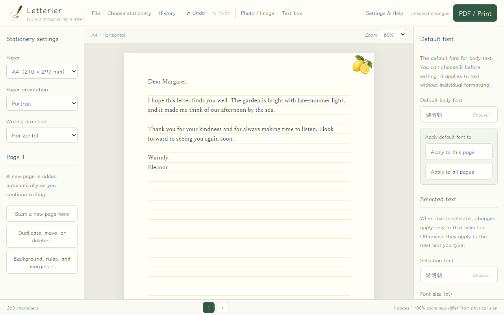
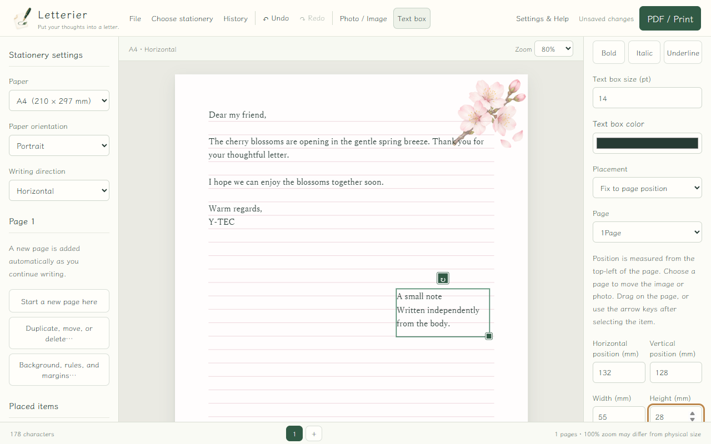

# Letterier User Manual

For version 1.0.4 / Windows 10 and 11, 64-bit

Letterier lets you write directly on stationery, add photos or text boxes, and finish your letter as a PDF or a printed page. Letters and images stay on your computer, and ordinary use does not require an internet connection.

## Distribution, system requirements, and contact

- Author: Y-TEC
- Distribution: Freeware. There are no paid features, trial limits, or payments.
- Software license: Apache License 2.0
- System requirements: 64-bit Windows 10 or 11 and Microsoft WebView2 Runtime
- Contact the author: [Y-TEC Forge contact](https://ytec.cloudfree.jp/forge/en/contact/)
- Product page: [Letterier on Y-TEC Forge](https://ytec.cloudfree.jp/forge/en/projects/letterier/)
- Source code: [GitHub](https://github.com/ytec-forge-commits/letterier)

For the portable ZIP edition, extract the ZIP before launching `Letterier.exe` from the extracted folder. Windows may show a warning because this edition uses a self-signed certificate. For the standard installer, run `Letterier-1.0.4-windows-x64-self-signed-setup.exe` and follow the prompts. For the Microsoft Store edition, select **Install** in Microsoft Store. The portable ZIP does not include WebView2 Runtime; install the official Microsoft Runtime if it is not already present.

To uninstall the portable ZIP edition, close Letterier and delete its extracted folder. To uninstall the standard installer or Microsoft Store edition, open **Windows Settings → Apps → Installed apps**, open the menu for **Letterier**, and select **Uninstall**. Your `.binsen`, `.binsenbak`, PDF, and image files are not deleted automatically. Check them first and delete only files you no longer need.

Authors, licenses, and usage terms for bundled third-party components, fonts, and image resources are documented in `THIRD_PARTY_NOTICES.md`, `ASSETS_LICENSE.md`, and the `legal` folder included with the distribution. These resources are used and distributed under their stated terms.

## Create your first letter

1. Select **Choose stationery** at the top.
2. Select a design and check the large preview on the right.
3. Select **Start a new letter with this stationery**.
4. Click the first writing line and type your letter.
5. Open **File**, then select **Save as…**.
6. Open **PDF / Print** to review every page, save a PDF, or print.

Each illustrated design uses separate primary and supporting artwork. Decoration stays in the outside margin, so choosing another design does not reduce the writing area.

## Screen overview

- Top: file, stationery, history, undo and redo, images, text boxes, settings, and output.
- Left: paper size, paper orientation, and writing direction.
- Center: the paper where you type and arrange items.
- Right: the default body font and formatting for selected text.
- Bottom: character count, page navigation, and zoom information.

In **Settings & Help**, enable **Make interface text and buttons larger** when standard controls are difficult to read. This changes only the controls, not the printed letter. You can also choose a higher-contrast color theme.

## Write in English

Choose **Horizontal** under **Writing direction**. Press Enter for a new paragraph and Ctrl+Enter for a deliberate page break. Letterier prefers spaces when wrapping English text, so ordinary words are not split at the page margin.

Vertical writing remains available for Japanese documents. For English letters, horizontal writing is recommended and is the format used throughout this manual.

## Fonts and formatting

Choose **Default body font** before you start writing. During editing, use **Apply to this page** or **Apply to all pages** to make the body consistent.

To change only part of the letter, select the text first, then set its font, size, bold, italic, underline, or color under **Selected text**. With no selection, formatting applies to the next text you type. A new line inherits the formatting of the line where you pressed Enter.

## Pages

A continuation page appears automatically when the current page is full. Use **Start a new page here** to insert a deliberate page break.

Use **Duplicate, move, or delete…** to preview a page operation before applying it. One page operation creates one undo step, so a single **Undo** restores the previous document arrangement.

## Photos and images

1. Select **Photo / Image** and choose a file.
2. Drag the image to position it.
3. Use the selected-item controls to adjust size, rotation, opacity, stacking, anchoring, and text wrapping.

To move an image to another page, keep holding it near the top or bottom edge. The document scrolls automatically and keeps the dragged image visible. After dropping it, check that the full image is inside the destination page.

## Text boxes

Select **Text box** to place text that moves independently from the letter body. Select the box, then choose **Horizontal** or **Vertical** under **Text box writing direction**. This setting is independent of the body writing direction, so a vertical note can be placed on a horizontal letter. Selecting body text continues normally even when the pointer crosses a text box.

## Save and recover work

Use **File → Save as…** to create a `.binsen` document. After that, Ctrl+S or **Save now** updates it.

Letterier also keeps local recovery data while you work. **History** stores 50 normal revisions plus protected versions and lets you preview a revision before restoring it. Use **Export backup with history…** to create a portable `.binsenbak` file.

Autosave is not a substitute for a separate backup. Save important letters by name and keep another copy on a different drive.

## Save a PDF or print

Open **PDF / Print** and review all pages before output.

- **Save as PDF** creates a PDF at the document's physical paper size.
- **Print** opens the Windows print flow.
- **Fit to printable area** is recommended for home printers because it avoids clipping at the paper edge.
- **Actual size** can clip edge decoration where a printer cannot print.

The dotted printable-area guide is for preview only and is not printed.

## Change the interface language

Open **Settings & Help**, then choose Japanese or English under **Display language**. Letterier remembers the choice for the next launch.

## Keyboard shortcuts

- Ctrl+S: Save
- Ctrl+Shift+S: Save as
- Ctrl+Z: Undo
- Ctrl+Y: Redo
- Ctrl+Enter: Page break
- Ctrl+A: Select the whole body while the paper is active

## Troubleshooting

- Caret not visible: click the writing line where you want to type. The caret also appears on unused lines.
- Cannot save: use **Save as…** in another folder, then check free disk space and write permission.
- Image cannot be opened: see [supported image formats](../../../IMAGE-FORMATS.md) or convert it to PNG or JPEG.
- Printing takes time: wait for the Windows print window and avoid pressing Print repeatedly. Text and rules remain vector; only stationery artwork and photos are embedded as images. The whole sheet is not flattened into one image.
- Controls are hard to read: enable larger interface text and choose a clearer color theme in **Settings & Help**.

When reporting a problem, include the Letterier version, the steps you followed, the result you expected, and what happened instead. Do not share private letter text or personal images unless they are necessary for the report.
