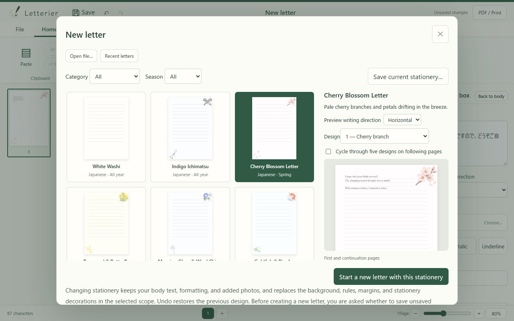
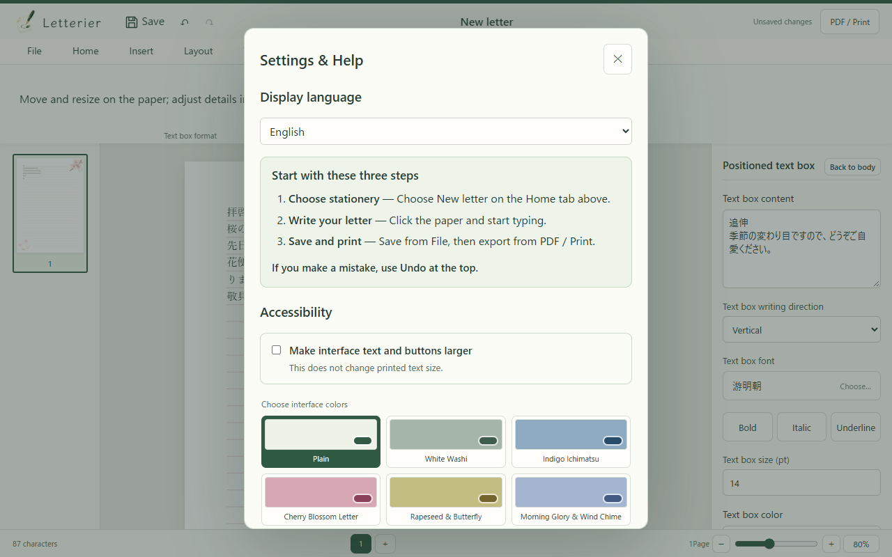
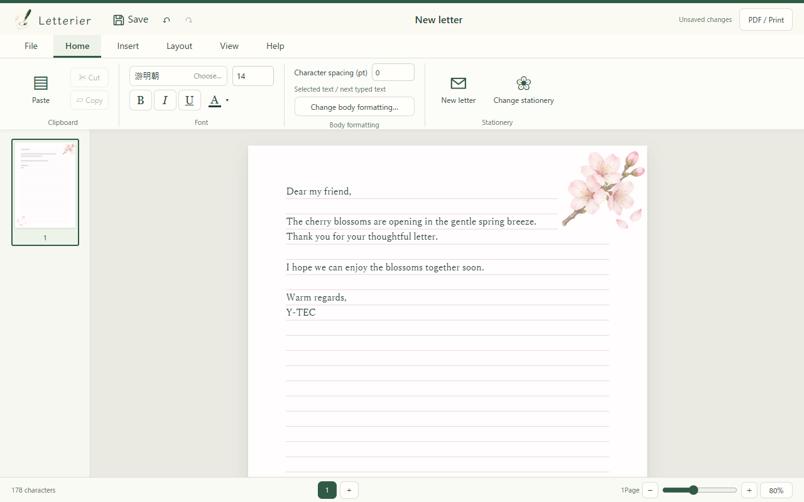
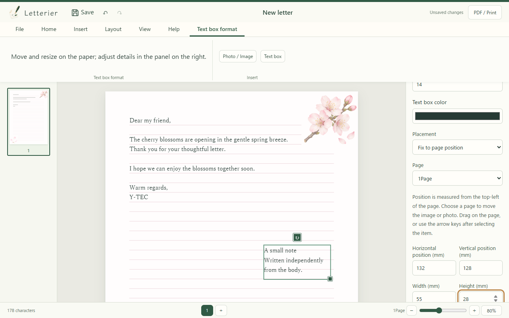

# Letterier User Manual

For version 2.0.1 / Windows 10 and 11, 64-bit

This manual covers Letterier 2.0.1. Check the applicable instructions for the current distribution, publication, and review status. WebView2 Runtime is required.

Letterier lets you write directly on stationery, add photos or text boxes, and finish your letter as a PDF or a printed page. Letters and images stay on your computer, and ordinary use does not require an internet connection.

## Distribution, system requirements, and contact

- Author: Y-TEC
- Distribution: Freeware. There are no paid features, trial limits, or payments.
- Software license: Apache License 2.0
- System requirements: 64-bit Windows 10 or 11 and Microsoft WebView2 Runtime
- Contact the author: [Y-TEC Forge contact](https://ytec.cloudfree.jp/forge/en/contact/)
- Product page: [Letterier on Y-TEC Forge](https://ytec.cloudfree.jp/forge/en/projects/letterier/)
- Source code: [GitHub](https://github.com/ytec-forge-commits/letterier)

For the portable ZIP edition, extract the ZIP before launching `Letterier.exe` from the extracted folder. Windows may show a warning because this edition uses a self-signed certificate. For the standard installer, run `Letterier-2.0.1-windows-x64-self-signed-setup.exe` and follow the prompts. For the Microsoft Store edition, select **Install** in Microsoft Store. The portable ZIP does not include WebView2 Runtime; install the official Microsoft Runtime if it is not already present.

To uninstall the portable ZIP edition, close Letterier and delete its extracted folder. To uninstall the standard installer or Microsoft Store edition, open **Windows Settings → Apps → Installed apps**, open the menu for **Letterier**, and select **Uninstall**. Your `.binsen`, `.binsenbak`, PDF, and image files are not deleted automatically. Check them first and delete only files you no longer need.

Authors, licenses, and usage terms for bundled third-party components, fonts, and image resources are documented in `THIRD_PARTY_NOTICES.md`, `ASSETS_LICENSE.md`, and the `legal` folder included with the distribution. These resources are used and distributed under their stated terms.

## Create your first letter

1. Use the startup **New letter** dialog, or choose **Home → New letter**.
2. Select a design and check the large preview on the right.
3. Select **Start a new letter with this stationery**.
4. Click the first writing line and type your letter.
5. Open **File**, then select **Save as…**.
6. Open **PDF / Print** to review every page, save a PDF, or print.

Each illustrated design uses separate primary and supporting artwork. Plain and rule-focused designs may have no illustration. Text wrapping accounts for margins and artwork placement, so lines near decoration can have a different available width.

All twenty series (ten Japanese and ten Western) offer five choices under **Design**. **Cycle through five designs on following pages** starts from the selected design and returns from design 5 to design 1. Turn it off to keep the same design. Personal templates use their saved settings.

## Screen overview

- Top: the File, Home, Insert, Layout, View, and Help ribbon tabs, save status, and PDF / Print.
- Left: an optional page list.
- Center: the paper where you type and arrange items.
- Right: detailed settings for a selected image or text box. Body formatting is on Home; paper settings and the default font are on Layout.
- Bottom: character count, page navigation, and zoom information.

In **Settings & Help**, enable **Make interface text and buttons larger** when standard controls are difficult to read. This changes only the controls, not the printed letter. You can also choose a higher-contrast color theme.

## Write in English

On **Layout**, choose **Horizontal** under **Writing direction**. Press Enter for a new paragraph and Ctrl+Enter for a deliberate page break. Letterier prefers spaces when wrapping English text, so ordinary words are not split at the page margin.

Vertical writing remains available for Japanese documents. For English letters, horizontal writing is recommended and is the format used throughout this manual.

## Fonts and formatting

Use **Default body size (pt)** on **Layout** to set the default from 6 to 72 pt. Text inheriting the default changes with it; sizes explicitly assigned to selected text remain unchanged. Use **Change body formatting…** to give the whole body the same size.

**Character spacing (pt)** on **Home** accepts 0 to 12 pt; 0 keeps normal spacing. It applies to selected body text, or to the next text you type when nothing is selected. It also works vertically, treating a two-digit upright combination as one unit. A selection with mixed spacing shows a blank field. Wider spacing can change wrapping and page count, so review every page before output.

**Keep first and last paragraph lines together** tries to avoid leaving only the first or last line of a paragraph on another page. Short paragraphs and paper constraints can prevent keeping every line together.

The **Text color** button on **Home** offers 20 swatches and **Custom color**. Select part of the body first to change only that selection. Click outside the palette, press Esc, or choose **Close** to dismiss it. Closing after keyboard interaction inside the palette returns focus to the Text color button.

Choose **Default body font** on **Layout** before you start writing. To change existing text, use the bulk body-format dialog on **Home** and choose the current page or all body text. Size and font can be changed separately while color, bold, italic, and underline are preserved. Include text boxes only when you want them changed too.

To change only part of the letter, select the text first, then set its font, size, bold, italic, underline, or color in the **Home** font controls. With no selection, formatting applies to the next text you type. A new line inherits the formatting of the line where you pressed Enter.

The size field is blank when the selection contains different font sizes; this does not mean text is missing. Enter a value from 6 to 72 pt to give the selection that size while preserving other formatting. Out-of-range input is not applied, and leaving the field restores the current-size display. Keep the intended text selected; Undo reverses a change.

Drag from selected body text to another position to move it with its formatting intact. Hold Ctrl when dropping to copy it instead. Copying body text does not duplicate images or text boxes. One Undo reverses the operation.

## Save and edit your own stationery

Open **Home → Change stationery**, then **Save current stationery…** and give it a name. Without the include-text option, the template stores backgrounds, rules, and images, but not body text or text boxes. Choose your saved template under the personal-template type in both New letter and Change stationery. Changing stationery preserves body text, formatting, and your added photos; choose all pages, the current page, or a page range.

To edit a template, apply it to a letter, make adjustments, then select the original registration and update it. Updating a registration does not change other letters already created from it.

## Backgrounds, line length, and rules

Open **Layout → Background, rules, and margins…**. Choose a background image, drag its preview to move it, and use the four corner handles to resize while preserving its aspect ratio. Fit-to-paper, contain, and reset controls are also available. Press Esc during a drag to cancel that gesture.

The target full-width characters per line is a guide based on the default font; leave it blank to use the margins. Mixed fonts, sizes, and Latin characters can change the actual character count. Text wraps to fit the paper, and lines with larger text receive enough spacing.

New letters enable font-size-aware automatic rule spacing and thickness by default. Disable the corresponding setting to adjust it manually. Opening an older document does not silently replace its manual rule settings with automatic ones.

## Pages

A continuation page appears automatically when the current page is full. Use **Start a new page here** to insert a deliberate page break.

Use **Duplicate, move, or delete…** to preview a page operation before applying it. One page operation creates one undo step, so a single **Undo** restores the previous document arrangement.

## Photos and images

1. On **Insert**, select **Photo / Image** and choose a file.
2. Drag the image to position it.
3. Use the selected-item controls to adjust size, rotation, opacity, stacking, anchoring, and text wrapping.

To move an image to another page, keep holding it near the top or bottom edge. The document scrolls automatically and keeps the dragged image visible. After dropping it, check that the full image is inside the destination page.

## Text boxes

Select **Text box** to place text that moves independently from the letter body. Select the box, then choose **Horizontal** or **Vertical** under **Text box writing direction**. This setting is independent of the body writing direction, so a vertical note can be placed on a horizontal letter. Selecting body text continues normally even when the pointer crosses a text box.

## Save and recover work

Use **File → Save as…** to create a `.binsen` document. After that, Ctrl+S or **Save** updates it. The recovery-save status refers to automatic local recovery data, not completion of a named-file save.

Letterier also keeps local recovery data while you work. **History** stores 50 normal revisions plus protected versions and lets you preview a revision before restoring it. Use **Export backup with history…** to create a portable `.binsenbak` file.

Automatic recovery never overwrites the original file. A failed recovery save shows a warning and retries up to three times, after 5, 15 and 30 seconds. Its warning clears on success. If failure persists, check the save status and save a named file. When creating, switching or closing, choosing Save stops that operation if saving fails or the destination dialog is cancelled. Normal startup does not silently reopen your last letter; open it explicitly from the recovery notice. The state before a history restoration is retained as a protected version.

Autosave is not a substitute for a separate backup. Save important letters by name and keep another copy on a different drive.

## Save a PDF or print

Open **PDF / Print** and review all pages before output.

Copies appear below the printer, followed by the page range. Check these settings before choosing **Print with these settings**. **Save as PDF** is at the bottom of the settings column.

- **Save as PDF** creates a PDF at the document's physical paper size.
- **Print with these settings** submits to the selected Windows printer. Check the printer, paper, copies, and every page before using it.
- **Fit to printable area** is recommended for home printers because it avoids clipping at the paper edge.
- **Actual size** can clip edge decoration where a printer cannot print.

The dotted printable-area guide is for preview only and is not printed.

Ordinary Latin letters and digits in vertical text stay upright in both the editor and PDF. ASCII brackets and two-digit vertical combinations use their own layout. Review every output page after mixing fonts or sizes.

Switch the preview between the selected print settings and actual-size PDF. Printer fit settings never shrink the PDF. Leave the page range blank for all pages, use `2` for page two only, or `1-3,5` for a range. Nonexistent page numbers disable output.

## Zoom and popups

The next launch restores the normal window size and maximized state saved when you closed the app. If the display arrangement changes, the window is adjusted to a visible work area. The default size may be used if the setting could not be saved.

The bottom-right slider adjusts display zoom from 50% to 125%. Minus and plus change it by 5%; clicking the percentage resets it to 100%. The **View** tab controls the same zoom. Zoom affects the screen only, not PDF or print dimensions, and 100% may not match physical size on your screen.

Dismissible screens such as Help also close when you click outside their frame. Pressing inside and dragging outside does not dismiss them. Use the provided controls for busy or mandatory dialogs. Dismissing an unsaved-change prompt cancels the pending switch.

## Change the interface language

Open **Settings & Help**, then choose Japanese or English under **Display language**. Letterier remembers the choice for the next launch.

## Keyboard shortcuts

- Ctrl+S: Save
- Ctrl+Shift+S: Save as
- Ctrl+Z: Undo
- Ctrl+Y: Redo
- Ctrl+Enter: Page break
- Ctrl+A: Select the whole body while the paper is active

## Troubleshooting

- Caret not visible: click the writing line where you want to type. The caret also appears on unused lines.
- Cannot save: use **Save as…** in another folder, then check free disk space and write permission.
- Image cannot be opened: see [supported image formats](../../../IMAGE-FORMATS.md) or convert it to PNG or JPEG.
- Printing takes time: wait for the Windows print window and avoid pressing Print repeatedly. Text and rules remain vector; only stationery artwork and photos are embedded as images. The whole sheet is not flattened into one image.
- Controls are hard to read: enable larger interface text and choose a clearer color theme in **Settings & Help**.

When reporting a problem, include the Letterier version, the steps you followed, the result you expected, and what happened instead. Do not share private letter text or personal images unless they are necessary for the report.
