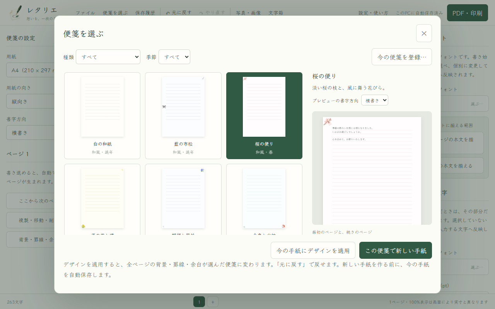
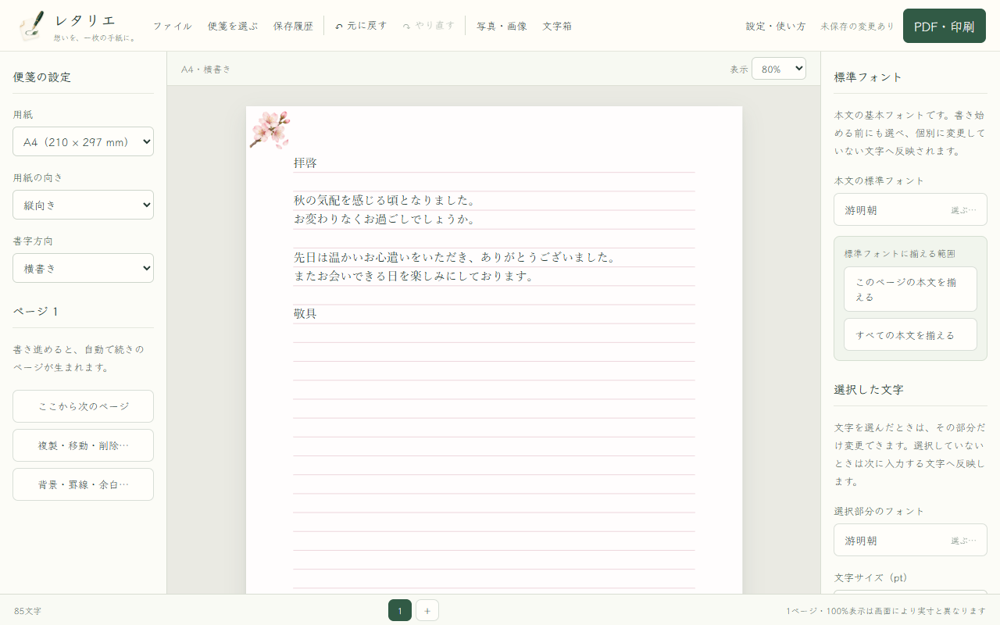
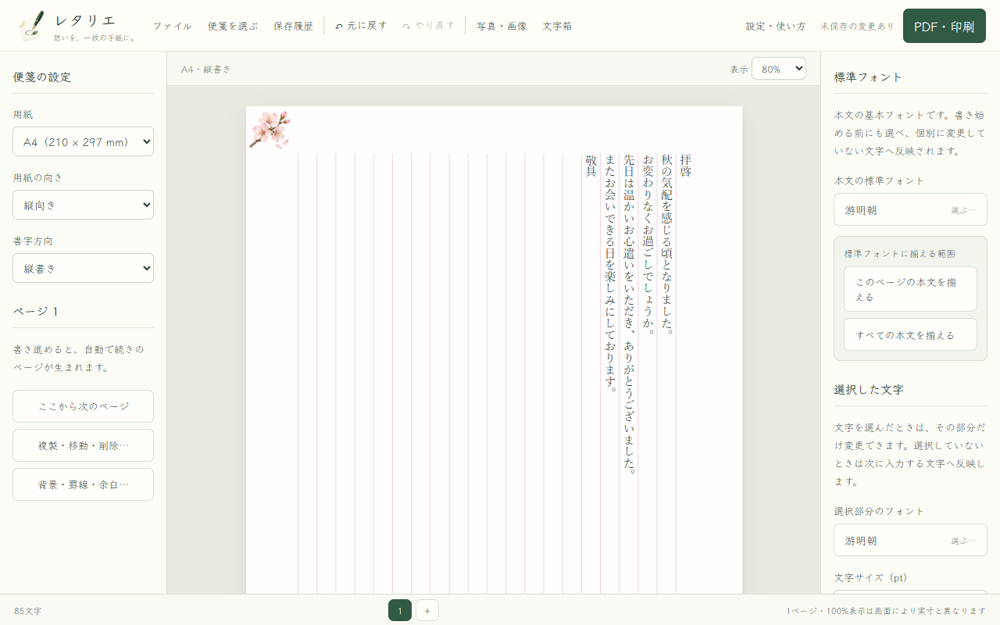
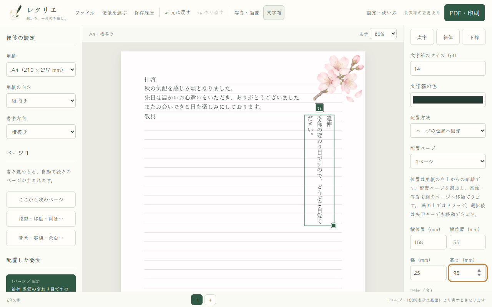

# レタリエ 操作マニュアル

対象バージョン: 1.0.4 / Windows 10・11（64ビット）

レタリエは、便箋を選び、紙の上へ直接文章を書き、写真や文字を添えて印刷できる手紙作成アプリです。手紙と画像はお使いのパソコン内で扱われ、通常の利用にインターネット接続は必要ありません。

## 配布情報・動作環境・作者への連絡先

- 作者: Y-TEC
- 取り扱い種別: フリーソフト（無料）。有料機能、試用期限、送金はありません。
- ソフトウェアライセンス: Apache License 2.0
- 動作環境: Windows 10・11（64ビット）、Microsoft WebView2 Runtime
- 作者への連絡先: [Y-TEC Forge お問い合わせ](https://ytec.cloudfree.jp/forge/contact/)
- 公式紹介ページ: [Y-TEC Forge レタリエ](https://ytec.cloudfree.jp/forge/projects/letterier/)
- ソースコード: [GitHub](https://github.com/ytec-forge-commits/letterier)

ポータブルZIP版はZIPを展開してから、フォルダー内の `Letterier.exe` を起動します。自己署名版のため、初回にWindowsの警告が表示されることがあります。通常インストーラー版は `Letterier-1.0.4-windows-x64-self-signed-setup.exe` を実行し、画面の案内に従います。Microsoft Store版はStoreの「インストール」を選びます。ポータブルZIP版にWebView2 Runtimeは同梱していません。未導入の場合はMicrosoft公式のRuntimeを導入してください。

アンインストールは、ポータブルZIP版ではレタリエを終了して展開先フォルダーを削除します。通常インストーラー版とMicrosoft Store版では、Windowsの「設定 → アプリ → インストールされているアプリ」で「レタリエ」のメニューを開き、「アンインストール」を選びます。利用者が保存した `.binsen`、`.binsenbak`、PDF、画像は自動では削除されません。必要なファイルを確認してから、不要なものだけを利用者自身で削除してください。

同梱する第三者コンポーネント、フォント、画像資源の著作者・ライセンス・利用条件は、配布物内の `THIRD_PARTY_NOTICES.md`、`ASSETS_LICENSE.md`、`legal` フォルダーに記載しています。各条件に従って利用・同梱しています。

## 最初の手紙を作る

1. 画面上部の「便箋を選ぶ」を押します。
2. 気に入った便箋を押し、右側の大きな見本で確認します。
3. 「この便箋で新しい手紙」を押します。
4. 白い用紙の書き始め位置を押して、文章を入力します。
5. 上部の「ファイル」から「名前を付けて保存」を選びます。
6. 「PDF・印刷」で仕上がりを確認し、PDF保存または印刷を行います。

主役と脇役のイラストは、それぞれ別の絵を使っています。装飾は用紙端の余白に収まり、どの便箋を選んでも本文の広さは変わりません。

## 画面の見方

- 上部: ファイル、便箋、保存履歴、元に戻す、写真・画像、文字箱、設定、PDF・印刷があります。
- 左側: 用紙サイズ、縦向き・横向き、横書き・縦書きを選びます。
- 中央: 実際の用紙です。ここを押して文章を書きます。
- 右側: 標準フォントと、選択した文字の書式を変更します。
- 下部: 文字数、ページ切り替え、表示状態を確認します。

「設定・使い方」で「操作画面の文字とボタンを大きくする」を選ぶと、印刷文字を変えずに操作部分だけを大きくできます。画面の配色も同じ場所で変更できます。

## 横書きで書く

左側の「書字方向」で「横書き」を選びます。段落を分けるときは Enter、強制的に次のページへ進めるときは Ctrl+Enter を使います。英文は単語の途中を避けて折り返します。

## 縦書きで書く

左側の「書字方向」で「縦書き」を選びます。文章は右上から左へ進みます。日本語入力中のIME変換候補は読みやすい横向きで表示され、確定した文字だけが縦書きになります。

改行した直後は次の行・列へカーソルが進みます。ページ末尾で改行すると、次ページの書き始めへ移ります。入力位置がおかしく見えた場合は、一度用紙の入力したい位置を押してください。

## フォントと文字の見た目

書き始める前は、右側の「本文の標準フォント」で手紙全体の基本フォントを選べます。途中で変える場合は、次のどちらかを使います。

- 「このページの本文を揃える」: 現在のページだけを標準フォントへ変更します。
- 「すべての本文を揃える」: 全ページを標準フォントへ変更します。

一部分だけ変えるときは、先に文字を選び、「選択した文字」でフォント、文字サイズ、太字、斜体、下線、文字色を変更します。選択せずに変更すると、次に入力する文字へ引き継がれます。書式を変えた行で Enter を押した場合も、次の行に同じ書式が引き継がれます。

## ページを扱う

文章が用紙いっぱいになると、続きのページが自動で追加されます。「ここから次のページ」を押すと、現在位置から明示的に改ページできます。

「複製・移動・削除…」では、実行前に内容を確認できます。ページ操作全体が1回分の履歴になるため、「元に戻す」を1回押せば直前のページ操作へ戻ります。

## 写真・画像を入れる

1. 上部の「写真・画像」を押してファイルを選びます。
2. 画像をドラッグして位置を調整します。
3. 選択中の操作欄で大きさ、回転、透明度、前後関係、本文の回り込みを調整します。

別ページへ移すときは、画像をつかんだまま用紙の上端または下端へ近づけます。画面が自動でスクロールし、ドラッグ中の画像を見失わずに次のページへ運べます。ドロップ後、画像全体が移動先の用紙内に入っていることを確認してください。

## 文字箱を入れる

上部の「文字箱」を押すと、本文とは別に動かせる文字を置けます。文字箱を選択し、右側の「文字箱の書字方向」で「横書き」または「縦書き」を選びます。手紙本文の書字方向とは別に設定できるため、横書きの本文へ縦書きの添え書きを置くこともできます。本文の文字を選ぶ操作は、途中に文字箱があってもそのまま続けられます。

## 保存と回復

「ファイル → 名前を付けて保存…」で `.binsen` ファイルを作ります。以後は Ctrl+S または「今すぐ保存」で上書きできます。

アプリは編集中の回復データをパソコン内へ自動保存します。「保存履歴」では通常50件と保護版を確認し、内容を見てから復元できます。履歴も一緒に持ち運ぶ場合は「履歴付きバックアップを書き出す…」で `.binsenbak` を作ります。

自動保存はバックアップの代わりではありません。大切な手紙は名前を付けて保存し、USBメモリーなど別の場所にもコピーしてください。

## PDF保存と印刷

「PDF・印刷」を押すと、出力前の全ページを確認できます。

- 「PDFに保存」: 用紙の実寸でPDFを作ります。
- 「印刷する」: Windowsの印刷画面へ進みます。
- 「紙面全体を印刷可能範囲へ縮小」: 家庭用プリンターで端が切れにくい推奨設定です。
- 「実寸」: 用紙端の装飾が、プリンターの印刷できない範囲で切れる場合があります。

プレビューの点線は印刷可能範囲の案内で、紙には印刷されません。

## 言語を切り替える

「設定・使い方 → 表示言語」で「日本語」または「English」を選びます。言語設定は次回起動時も保持されます。英語で手紙を書く場合は横書きを推奨します。

## よく使うキー

- Ctrl+S: 保存
- Ctrl+Shift+S: 名前を付けて保存
- Ctrl+Z: 元に戻す
- Ctrl+Y: やり直す
- Ctrl+Enter: 改ページ
- Ctrl+A: 用紙内で本文をすべて選択

## 困ったとき

- 文字が見えない: 用紙内の入力したい罫線を押します。空白部分でもカーソルが表示されます。
- 保存できない: 別のフォルダーへ「名前を付けて保存」を行い、空き容量と書き込み権限を確認します。
- 画像を開けない: [対応画像形式](../../../IMAGE-FORMATS.md)を確認し、一般的なPNGまたはJPEGへ変換します。
- 印刷に時間がかかる: 印刷画面が開くまで待ち、同じ操作を何度も押さないでください。本文と罫線はベクターで出力し、便箋イラストと写真だけを画像として埋め込みます。用紙全体を1枚の画像にはしません。
- 画面が読みにくい: 「設定・使い方」で大きい操作文字と見やすい配色を選びます。

不具合を報告するときは、レタリエのバージョン、行った操作、期待した結果、実際の結果を添えてください。手紙の本文や個人情報を含む画像は、必要がない限り共有しないでください。
