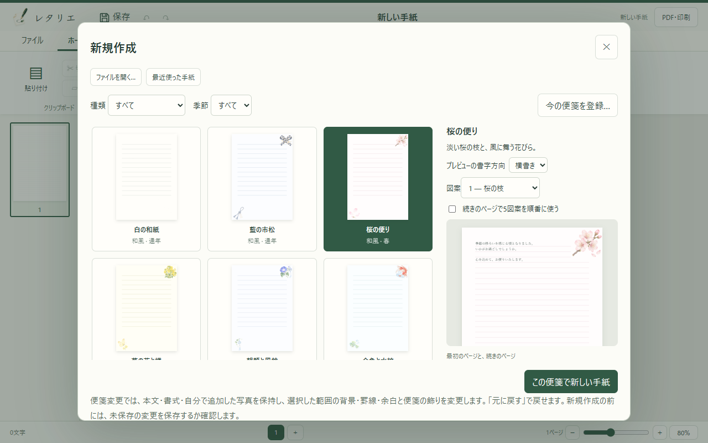
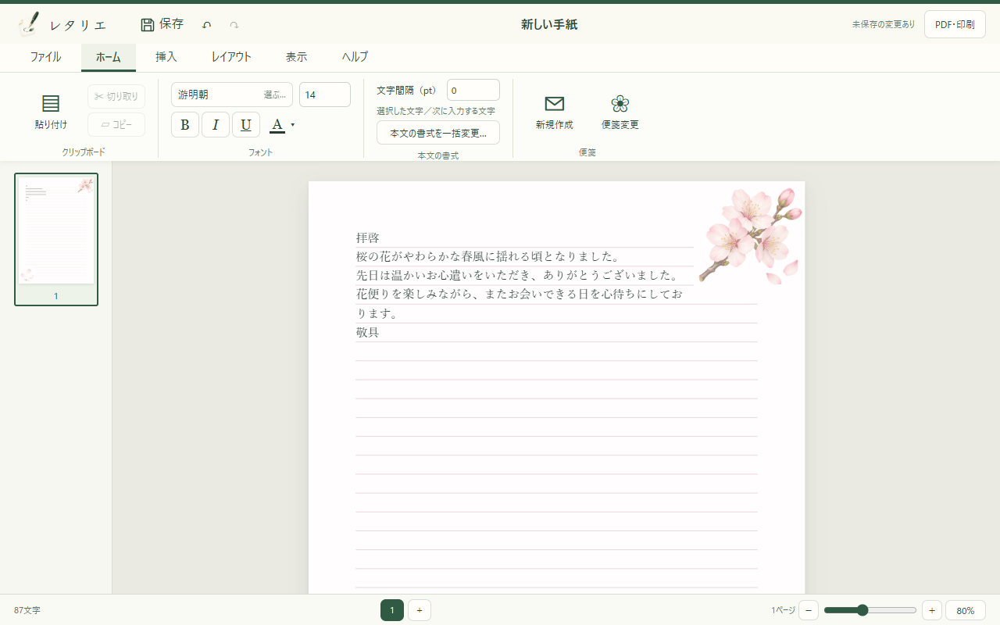
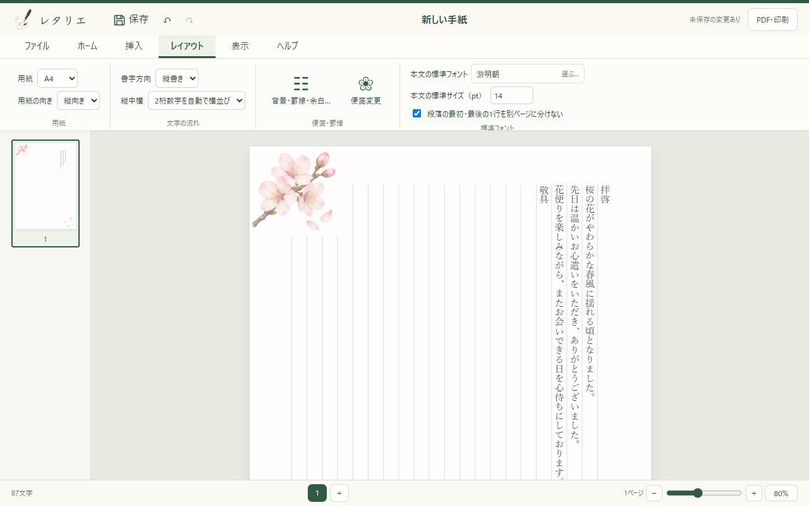
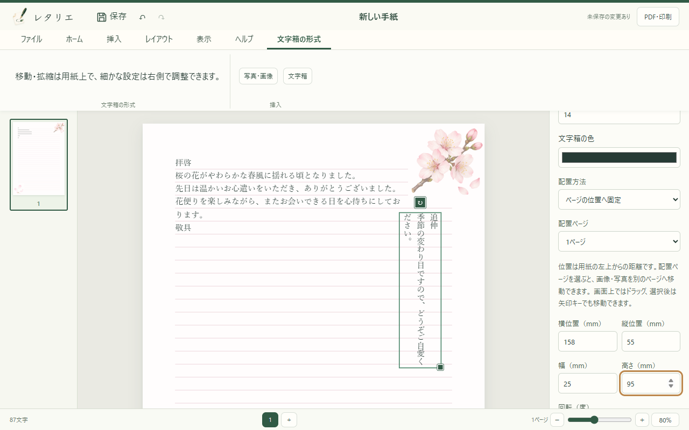

# レタリエ 操作マニュアル

対象バージョン: 2.0.1 / Windows 10・11（64ビット）

この説明書はレタリエ2.0.1を対象とします。配布形態や公開・審査の状態は、実際の案内をご確認ください。WebView2 Runtimeが必要です。

レタリエは、便箋を選び、紙の上へ直接文章を書き、写真や文字を添えて印刷できる手紙作成アプリです。手紙と画像はお使いのパソコン内で扱われ、通常の利用にインターネット接続は必要ありません。

## 配布情報・動作環境・作者への連絡先

- 作者: Y-TEC
- 取り扱い種別: フリーソフト（無料）。有料機能、試用期限、送金はありません。
- ソフトウェアライセンス: Apache License 2.0
- 動作環境: Windows 10・11（64ビット）、Microsoft WebView2 Runtime
- 作者への連絡先: [Y-TEC Forge お問い合わせ](https://ytec.cloudfree.jp/forge/contact/)
- 公式紹介ページ: [Y-TEC Forge レタリエ](https://ytec.cloudfree.jp/forge/projects/letterier/)
- ソースコード: [GitHub](https://github.com/ytec-forge-commits/letterier)

ポータブルZIP版はZIPを展開してから、フォルダー内の `Letterier.exe` を起動します。自己署名版のため、初回にWindowsの警告が表示されることがあります。通常インストーラー版は `Letterier-2.0.1-windows-x64-self-signed-setup.exe` を実行し、画面の案内に従います。Microsoft Store版はStoreの「インストール」を選びます。ポータブルZIP版にWebView2 Runtimeは同梱していません。未導入の場合はMicrosoft公式のRuntimeを導入してください。

アンインストールは、ポータブルZIP版ではレタリエを終了して展開先フォルダーを削除します。通常インストーラー版とMicrosoft Store版では、Windowsの「設定 → アプリ → インストールされているアプリ」で「レタリエ」のメニューを開き、「アンインストール」を選びます。利用者が保存した `.binsen`、`.binsenbak`、PDF、画像は自動では削除されません。必要なファイルを確認してから、不要なものだけを利用者自身で削除してください。

同梱する第三者コンポーネント、フォント、画像資源の著作者・ライセンス・利用条件は、配布物内の `THIRD_PARTY_NOTICES.md`、`ASSETS_LICENSE.md`、`legal` フォルダーに記載しています。各条件に従って利用・同梱しています。

## 最初の手紙を作る

1. 起動時の「新規作成」、または「ホーム → 新規作成」を開きます。
2. 気に入った便箋を押し、右側の大きな見本で確認します。
3. 「この便箋で新しい手紙」を押します。
4. 白い用紙の書き始め位置を押して、文章を入力します。
5. 上部の「ファイル」から「名前を付けて保存」を選びます。
6. 「PDF・印刷」で仕上がりを確認し、PDF保存または印刷を行います。

主役と脇役のイラストは、それぞれ別の絵を使っています。無地・罫線主体の図案はイラストを持たない場合があります。本文は余白とイラストの配置を考慮して折り返すため、装飾に近い行は書ける幅が変わることがあります。

和風10・洋風10の全20シリーズで「図案」から各5種類を選べます。「続きのページで5図案を順番に使う」を選ぶと、選択図案から順に巡回し、図案5の次は図案1へ戻ります。チェックを外すと同じ図案を使います。自分のテンプレートは登録した設定を使います。

## 画面の見方

- 上部: 「ファイル」「ホーム」「挿入」「レイアウト」「表示」「ヘルプ」のリボン、保存状態、PDF・印刷があります。
- 左側: ページ一覧を表示できます。
- 中央: 実際の用紙です。ここを押して文章を書きます。
- 右側: 選択した写真や文字箱の細かな設定を変更します。本文の書式は「ホーム」、用紙と標準フォントは「レイアウト」で変更します。
- 下部: 文字数、ページ切り替え、表示状態を確認します。

「設定・使い方」で「操作画面の文字とボタンを大きくする」を選ぶと、印刷文字を変えずに操作部分だけを大きくできます。画面の配色も同じ場所で変更できます。

## 横書きで書く

「レイアウト」の「書字方向」で「横書き」を選びます。段落を分けるときは Enter、強制的に次のページへ進めるときは Ctrl+Enter を使います。英文は単語の途中を避けて折り返します。

## 縦書きで書く

「レイアウト」の「書字方向」で「縦書き」を選びます。文章は右上から左へ進みます。日本語入力中のIME変換候補は読みやすい横向きで表示され、確定した文字だけが縦書きになります。

改行した直後は次の行・列へカーソルが進みます。ページ末尾で改行すると、次ページの書き始めへ移ります。入力位置がおかしく見えた場合は、一度用紙の入力したい位置を押してください。

## フォントと文字の見た目

「レイアウト」の「本文の標準サイズ（pt）」で6～72ptの基本サイズを指定できます。標準サイズを引き継いでいる本文は一緒に変わりますが、選択して個別に指定したサイズは保持されます。本文全体を同じサイズへ揃える場合は「本文の書式を一括変更…」を使います。

「ホーム」の「文字間隔（pt）」は0～12ptで、0は通常の間隔です。本文を選択するとその範囲へ、選択しない場合は次に入力する文字へ適用します。縦書きでも使用でき、縦中横の2桁数字はひとまとまりとして間隔を付けます。選択範囲に異なる間隔が混在すると欄は空欄になります。間隔を広げると折り返しやページ数が変わるため、出力前に全ページを確認してください。

「段落の最初・最後の1行を別ページに分けない」は、段落がページをまたぐとき、最初や最後の1行だけが別ページへ孤立するのをできるだけ防ぐ設定です。短い段落や紙面の制約によって、常に同じページへ収められるとは限りません。

「ホーム」の文字色ボタンから20色のパレットまたは「任意の色」を選べます。先に本文の一部分を選ぶと、その範囲だけの色を変更します。パレットは外側のクリック、Esc、または「閉じる」で閉じます。キーボードでパレット内を操作して閉じた場合は、文字色ボタンへフォーカスが戻ります。

書き始める前は、「レイアウト」の「本文の標準フォント」で基本フォントを選べます。既に入力した本文を変更する場合は、「ホーム → 本文の書式を一括変更…」を開き、現在のページまたはすべての本文を選びます。サイズとフォントは別々に指定でき、色・太字・斜体・下線は維持します。文字箱も変更したい場合だけ、そのチェックを入れます。

一部分だけ変えるときは、先に文字を選び、「ホーム」のフォント欄でフォント、文字サイズ、太字、斜体、下線、文字色を変更します。選択せずに変更すると、次に入力する文字へ引き継がれます。書式を変えた行で Enter を押した場合も、次の行に同じ書式が引き継がれます。

選択範囲に複数の文字サイズが混在しているときは、サイズ欄が空欄になります。これは文字が消えたという意味ではありません。6～72ptの値を入力すると選択範囲をその大きさへ揃え、他の書式は保持します。範囲外の入力は適用せず、欄から移動すると現在のサイズ表示へ戻ります。選択範囲を変えずに操作し、「元に戻す」で変更を戻せます。

選択した本文の上から別の位置へドラッグすると、書式を保って移動できます。ドロップ時にCtrlを押しているとコピーします。本文コピーで画像や文字箱は複製しません。操作は1回の「元に戻す」で戻せます。

## 自分の便箋を保存・再編集する

「ホーム → 便箋変更」を開き、「今の便箋を登録…」で名前を付けます。本文を含めない場合は、背景・罫線・画像を保存し、本文と文字箱は含めません。登録した便箋は「種類 → 自分のテンプレート」で選べ、新規作成と便箋変更の両方で使えます。便箋変更では本文と書式、自分で追加した写真を保持し、すべてのページ・現在のページ・指定範囲から適用先を選べます。

再編集は、登録した便箋を手紙へ適用して調整した後、元の登録を選んで更新します。登録内容の更新で、既に作成した他の手紙が変わることはありません。

## 背景・文字数・罫線を調整する

「レイアウト → 背景・罫線・余白…」で設定します。背景画像を選び、プレビューをドラッグして移動し、四隅のハンドルで縦横比を保って拡縮できます。「紙面に合わせる」「全体を収める」「位置と大きさをリセット」も利用できます。適用前のドラッグは Esc で取り消せます。

「1行の目安文字数（全角）」は標準フォントを基準とした目安で、空欄なら余白に合わせます。異なるフォント・大きさ・英数字を混ぜると実際の文字数は変わり、用紙に収まるように折り返します。大きな文字がある行では必要な行間を確保します。

新しい手紙ではフォントサイズに合わせる罫線の間隔・太さの自動調整を標準で有効にしています。それぞれ手動で指定したい場合は対応するチェックを外します。旧文書の手動設定は、読み込んだだけでは自動設定に切り替わりません。

## ページを扱う

文章が用紙いっぱいになると、続きのページが自動で追加されます。「ここから次のページ」を押すと、現在位置から明示的に改ページできます。

「複製・移動・削除…」では、実行前に内容を確認できます。ページ操作全体が1回分の履歴になるため、「元に戻す」を1回押せば直前のページ操作へ戻ります。

## 写真・画像を入れる

1. 「挿入 → 写真・画像」を押してファイルを選びます。
2. 画像をドラッグして位置を調整します。
3. 選択中の操作欄で大きさ、回転、透明度、前後関係、本文の回り込みを調整します。

別ページへ移すときは、画像をつかんだまま用紙の上端または下端へ近づけます。画面が自動でスクロールし、ドラッグ中の画像を見失わずに次のページへ運べます。ドロップ後、画像全体が移動先の用紙内に入っていることを確認してください。

## 文字箱を入れる

「挿入 → 文字箱」を押すと、本文とは別に動かせる文字を置けます。文字箱を選択し、右側の「文字箱の書字方向」で「横書き」または「縦書き」を選びます。手紙本文の書字方向とは別に設定できるため、横書きの本文へ縦書きの添え書きを置くこともできます。本文の文字を選ぶ操作は、途中に文字箱があってもそのまま続けられます。

## 保存と回復

「ファイル → 名前を付けて保存…」で `.binsen` ファイルを作ります。以後は Ctrl+S または「保存」で上書きできます。「回復用データ保存済み」は自動の回復用保存の状態であり、名前を付けたファイルの保存完了とは別です。

アプリは編集中の回復データをパソコン内へ自動保存します。「保存履歴」では通常50件と保護版を確認し、内容を見てから復元できます。履歴も一緒に持ち運ぶ場合は「履歴付きバックアップを書き出す…」で `.binsenbak` を作ります。

回復データの自動保存は元のファイルを書き換えません。失敗した場合は警告を表示し、5秒・15秒・30秒後に最大3回再試行します。成功すると自動保存の警告は消えますが、失敗が続く場合は保存状態を確認し、名前を付けてファイル保存してください。新規作成・切替・終了で「保存する」を選んで保存に失敗した場合や保存先選択をキャンセルした場合は、その操作を中止します。通常起動では前回文書を勝手に開かず、回復通知から明示的に開けます。履歴から復元する前の状態は保護版として残ります。

自動保存はバックアップの代わりではありません。大切な手紙は名前を付けて保存し、USBメモリーなど別の場所にもコピーしてください。

## PDF保存と印刷

「PDF・印刷」を押すと、出力前の全ページを確認できます。

プリンターの下に「部数」、その下に「出力するページ」を並べています。印刷する場合は設定を確認して「この設定で印刷する」を押します。PDF用の「PDFとして保存…」は設定欄の一番下にあります。

- 「PDFとして保存…」: 保存先を選び、用紙の実寸でPDFを作ります。
- 「この設定で印刷する」: 選択したWindowsプリンターへ送信します。実行前にプリンター・用紙・部数・全ページを確認してください。
- 「紙面全体を印刷可能範囲へ縮小」: 家庭用プリンターで端が切れにくい推奨設定です。
- 「実寸」: 用紙端の装飾が、プリンターの印刷できない範囲で切れる場合があります。

プレビューの点線は印刷可能範囲の案内で、紙には印刷されません。

縦書きの通常の英数字は、編集画面とPDFのどちらも正立して表示します。ASCII括弧や縦中横の2桁数字は別の組み方を使います。途中で書体・サイズを変えた手紙は、出力前に全ページを確認してください。

「プレビューの内容」で印刷設定の表示と「PDF（実寸）」を切り替えます。PDFにはプリンター用の縮小設定を反映しません。「出力するページ」は空欄ですべて、`2`で2ページ目のみ、`1-3,5`で範囲を指定できます。存在しないページ番号では出力できません。

## 表示倍率とポップアップ

終了時の通常ウィンドウの大きさと最大化状態を次回起動時に引き継ぎます。ディスプレイ構成が変わった場合は、表示できる範囲へ補正します。設定を保存できなかった場合は既定の大きさを使うことがあります。

右下のスライダーで表示倍率を50～125%に調整できます。「−」「＋」は5%ずつ変更し、倍率のボタンを押すと100%へ戻ります。「表示」タブからも同じ倍率を指定できます。倍率は画面表示だけに影響し、PDFや印刷の寸法は変わりません。100%表示が画面上の実寸と一致するとは限りません。

ヘルプなどの閉じられる画面は、枠の外をクリックしても閉じられます。画面内で押してから外へドラッグしただけでは閉じません。処理中や必須の確認は、用意されたボタンで操作してください。未保存確認を閉じる操作は切替のキャンセルです。

## 言語を切り替える

「設定・使い方 → 表示言語」で「日本語」または「English」を選びます。言語設定は次回起動時も保持されます。英語で手紙を書く場合は横書きを推奨します。

## よく使うキー

- Ctrl+S: 保存
- Ctrl+Shift+S: 名前を付けて保存
- Ctrl+Z: 元に戻す
- Ctrl+Y: やり直す
- Ctrl+Enter: 改ページ
- Ctrl+A: 用紙内で本文をすべて選択

## 困ったとき

- 文字が見えない: 用紙内の入力したい罫線を押します。空白部分でもカーソルが表示されます。
- 保存できない: 別のフォルダーへ「名前を付けて保存」を行い、空き容量と書き込み権限を確認します。
- 画像を開けない: [対応画像形式](../../../IMAGE-FORMATS.md)を確認し、一般的なPNGまたはJPEGへ変換します。
- 印刷に時間がかかる: 印刷画面が開くまで待ち、同じ操作を何度も押さないでください。本文と罫線はベクターで出力し、便箋イラストと写真だけを画像として埋め込みます。用紙全体を1枚の画像にはしません。
- 画面が読みにくい: 「設定・使い方」で大きい操作文字と見やすい配色を選びます。

不具合を報告するときは、レタリエのバージョン、行った操作、期待した結果、実際の結果を添えてください。手紙の本文や個人情報を含む画像は、必要がない限り共有しないでください。
